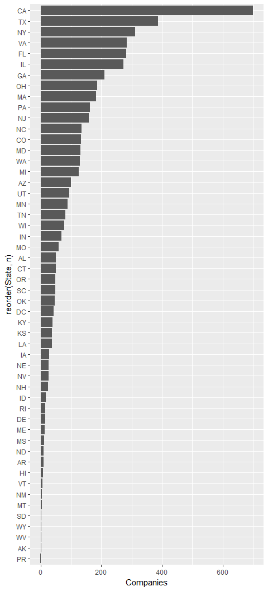
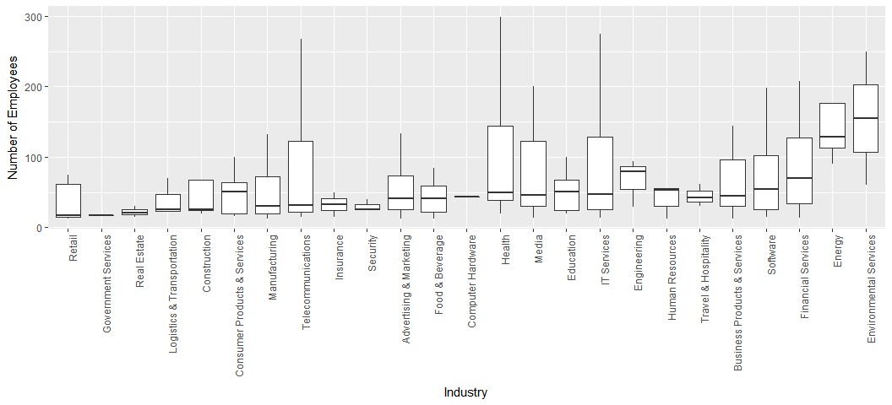
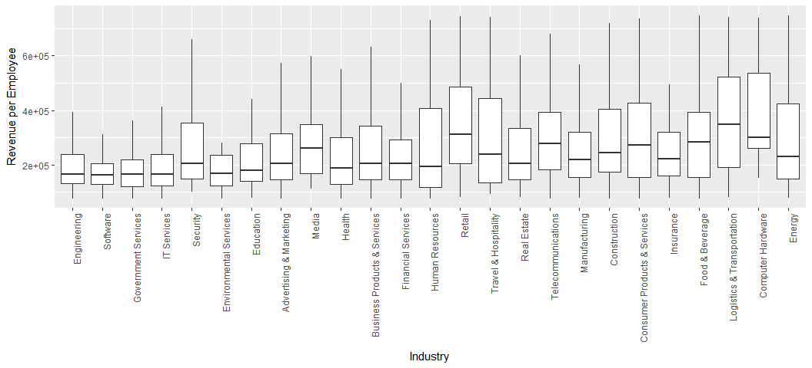

# Data 608 - HW 1
Georgia Galanopoulos  
February 4, 2018  

```r
library(knitr)
library(dplyr)
```

```
## Warning: package 'dplyr' was built under R version 3.3.3
```

```
## 
## Attaching package: 'dplyr'
```

```
## The following objects are masked from 'package:stats':
## 
##     filter, lag
```

```
## The following objects are masked from 'package:base':
## 
##     intersect, setdiff, setequal, union
```

```r
library(FSA)
```

```
## Warning: package 'FSA' was built under R version 3.3.3
```

```
## ## FSA v0.8.17. See citation('FSA') if used in publication.
## ## Run fishR() for related website and fishR('IFAR') for related book.
```

```r
library(ggplot2)
```

**Principles of Data Visualization and Introduction to ggplot2**

I have provided you with data about the 5,000 fastest growing companies in the US, as compiled by Inc. magazine. lets read this in:


```r
inc <- read.csv("https://raw.githubusercontent.com/charleyferrari/CUNY_DATA_608/master/module1/Data/inc5000_data.csv", header= TRUE)
```

And lets preview this data:


```r
head(inc)
```

```
##   Rank                         Name Growth_Rate   Revenue
## 1    1                         Fuhu      421.48 1.179e+08
## 2    2        FederalConference.com      248.31 4.960e+07
## 3    3                The HCI Group      245.45 2.550e+07
## 4    4                      Bridger      233.08 1.900e+09
## 5    5                       DataXu      213.37 8.700e+07
## 6    6 MileStone Community Builders      179.38 4.570e+07
##                       Industry Employees         City State
## 1 Consumer Products & Services       104   El Segundo    CA
## 2          Government Services        51     Dumfries    VA
## 3                       Health       132 Jacksonville    FL
## 4                       Energy        50      Addison    TX
## 5      Advertising & Marketing       220       Boston    MA
## 6                  Real Estate        63       Austin    TX
```

```r
summary(inc)
```

```
##       Rank                          Name       Growth_Rate     
##  Min.   :   1   (Add)ventures         :   1   Min.   :  0.340  
##  1st Qu.:1252   @Properties           :   1   1st Qu.:  0.770  
##  Median :2502   1-Stop Translation USA:   1   Median :  1.420  
##  Mean   :2502   110 Consulting        :   1   Mean   :  4.612  
##  3rd Qu.:3751   11thStreetCoffee.com  :   1   3rd Qu.:  3.290  
##  Max.   :5000   123 Exteriors         :   1   Max.   :421.480  
##                 (Other)               :4995                    
##     Revenue                                  Industry      Employees      
##  Min.   :2.000e+06   IT Services                 : 733   Min.   :    1.0  
##  1st Qu.:5.100e+06   Business Products & Services: 482   1st Qu.:   25.0  
##  Median :1.090e+07   Advertising & Marketing     : 471   Median :   53.0  
##  Mean   :4.822e+07   Health                      : 355   Mean   :  232.7  
##  3rd Qu.:2.860e+07   Software                    : 342   3rd Qu.:  132.0  
##  Max.   :1.010e+10   Financial Services          : 260   Max.   :66803.0  
##                      (Other)                     :2358   NA's   :12       
##             City          State     
##  New York     : 160   CA     : 701  
##  Chicago      :  90   TX     : 387  
##  Austin       :  88   NY     : 311  
##  Houston      :  76   VA     : 283  
##  San Francisco:  75   FL     : 282  
##  Atlanta      :  74   IL     : 273  
##  (Other)      :4438   (Other):2764
```

Think a bit on what these summaries mean. Use the space below to add some more relevant non-visual exploratory information you think helps you understand this data:


```r
# Structure of inc
str(inc)
```

```
## 'data.frame':	5001 obs. of  8 variables:
##  $ Rank       : int  1 2 3 4 5 6 7 8 9 10 ...
##  $ Name       : Factor w/ 5001 levels "(Add)ventures",..: 1770 1633 4423 690 1198 2839 4733 1468 1869 4968 ...
##  $ Growth_Rate: num  421 248 245 233 213 ...
##  $ Revenue    : num  1.18e+08 4.96e+07 2.55e+07 1.90e+09 8.70e+07 ...
##  $ Industry   : Factor w/ 25 levels "Advertising & Marketing",..: 5 12 13 7 1 20 10 1 5 21 ...
##  $ Employees  : int  104 51 132 50 220 63 27 75 97 15 ...
##  $ City       : Factor w/ 1519 levels "Acton","Addison",..: 391 365 635 2 139 66 912 1179 131 1418 ...
##  $ State      : Factor w/ 52 levels "AK","AL","AR",..: 5 47 10 45 20 45 44 5 46 41 ...
```

```r
# Number of NAs for each column
sapply(inc, function(x){sum(length(which(is.na(x))))})
```

```
##        Rank        Name Growth_Rate     Revenue    Industry   Employees 
##           0           0           0           0           0          12 
##        City       State 
##           0           0
```

```r
# Subset for NA values
kable(inc[is.na(inc$Employees),])
```

        Rank  Name                                Growth_Rate     Revenue  Industry                        Employees  City            State 
-----  -----  ---------------------------------  ------------  ----------  -----------------------------  ----------  --------------  ------
183      183  First Flight Solutions                    22.32     2700000  Logistics & Transportation             NA  Emerald Isle    NC    
1063    1064  Popchips                                   3.98    93300000  Food & Beverage                        NA  San Francisco   CA    
1123    1124  Vocalocity                                 3.72    42900000  Telecommunications                     NA  Atlanta         GA    
1652    1653  Higher Logic                               2.36     6000000  Software                               NA  Washington      DC    
1685    1686  Global Communications Group                2.30     3600000  Telecommunications                     NA  Englewood       CO    
2196    2197  JeffreyM Consulting                        1.68    12100000  Business Products & Services           NA  Bellevue        WA    
2742    2743  Excalibur Exhibits                         1.27     9900000  Business Products & Services           NA  houston         TX    
3000    3001  Heartland Business Systems                 1.12   156300000  IT Services                            NA  Little Chute    WI    
3978    3978  SSEC                                       0.68    80400000  Manufacturing                          NA  Horsham         PA    
4112    4112  Carolinas Home Medical Equipment           0.64     3300000  Health                                 NA  Matthews        NC    
4566    4566  Oakbrook                                   0.48     8900000  Real Estate                            NA  Madison         WI    
4968    4968  Popcorn Palace                             0.35     5500000  Food & Beverage                        NA  Schiller Park   IL    

```r
# Correlation Matrix
noNA = inc[complete.cases(inc), ]
round(cor(noNA[,sapply(noNA, is.numeric)]),2)
```

```
##              Rank Growth_Rate Revenue Employees
## Rank         1.00       -0.40    0.08      0.05
## Growth_Rate -0.40        1.00    0.01     -0.02
## Revenue      0.08        0.01    1.00      0.28
## Employees    0.05       -0.02    0.28      1.00
```

```r
# Viewing Growth Rate by State
grsta = data.frame(Summarize(Growth_Rate ~ State, data=noNA))
grsta[order(grsta$mean, decreasing = T),]
```

```
##    State   n      mean         sd  min     Q1 median      Q3    max
## 52    WY   2 19.145000 26.0710270 0.71 9.9280 19.140 28.3600  37.58
## 22    ME  13 16.210000 29.4176240 0.40 1.0900  2.340  4.0500  85.85
## 41    RI  16 16.031250 41.1223365 0.90 1.5250  2.705  7.8850 166.90
## 8     DC  42  8.439524 20.0066502 0.40 0.9150  1.955  6.8920 123.30
## 12    HI   7  6.792857  6.5699815 0.84 1.8600  2.650 12.1200  16.09
## 46    UT  95  6.307790 18.3556180 0.37 0.9000  1.940  5.4250 169.80
## 42    SC  48  6.060625 18.6395304 0.35 0.7750  1.790  3.7850 128.60
## 45    TX 386  6.036503 18.4725980 0.35 0.7600  1.525  3.3780 233.10
## 5     CA 700  5.900229 20.2242717 0.35 0.8875  1.665  4.4280 421.50
## 10    FL 282  5.846099 19.1693249 0.34 0.8150  1.610  3.7700 245.40
## 26    MS  12  5.642500 11.5650367 0.61 0.7975  1.090  2.8120  40.87
## 20    MA 182  5.416648 17.4648338 0.35 0.7000  1.400  3.3950 213.40
## 7     CT  50  4.994600  9.4277585 0.43 0.6825  1.340  3.4700  44.41
## 21    MD 131  4.984809  8.8830697 0.36 0.8600  1.780  4.7700  63.92
## 6     CO 133  4.971955 11.5075434 0.35 0.7100  1.580  2.7600  81.01
## 44    TN  82  4.950366 19.6149349 0.36 0.6725  1.180  2.5520 174.00
## 47    VA 283  4.877350 18.3493647 0.35 0.8600  1.500  3.4650 248.30
## 1     AK   2  4.805000  6.2013265 0.42 2.6120  4.805  6.9980   9.19
## 16    IN  69  4.788261  7.7749600 0.39 1.0800  2.120  4.6200  43.23
## 4     AZ 100  4.616700 10.1254101 0.35 0.7850  1.485  2.9750  67.64
## 32    NJ 158  4.445380  9.9623487 0.34 0.8425  1.455  3.0920 105.70
## 35    NY 311  4.371158 10.0783900 0.35 0.6700  1.310  3.5800  84.43
## 49    WA 129  4.020698  9.8307488 0.34 0.8300  1.520  2.8600  90.44
## 24    MN  88  3.821477  7.8264090 0.42 0.8075  1.385  3.1880  60.31
## 15    IL 272  3.751213  7.6978205 0.34 0.7800  1.455  3.1480  70.63
## 17    KS  38  3.628684  6.5704355 0.42 0.7850  1.125  1.9320  29.98
## 36    OH 186  3.557527  9.7010868 0.35 0.6400  1.250  2.8450 100.10
## 11    GA 211  3.522607  7.1449688 0.36 0.8150  1.400  2.8600  72.48
## 28    NC 135  3.393630  6.8986761 0.34 0.7500  1.580  3.0500  65.54
## 38    OR  49  3.148367  5.5421432 0.37 0.7400  1.230  2.0300  29.75
## 37    OK  46  3.097174  7.7560791 0.35 0.8775  1.285  2.8070  53.28
## 50    WI  77  2.739351  5.9638016 0.36 0.6300  0.980  2.2800  40.39
## 14    ID  17  2.645294  2.7693346 0.41 0.7800  1.340  4.1800   9.29
## 39    PA 163  2.578159  5.0215297 0.34 0.7250  1.300  2.2750  48.39
## 25    MO  59  2.497288  4.7378112 0.35 0.7650  1.100  2.0850  34.50
## 9     DE  16  2.420000  2.2573849 0.36 1.1150  1.530  2.3550   7.13
## 2     AL  51  2.407451  3.2231766 0.37 0.6950  1.320  2.5850  16.64
## 34    NV  26  2.330769  2.9858479 0.37 0.7550  1.305  2.0220  11.26
## 23    MI 126  2.238571  3.7379827 0.37 0.7825  1.190  2.3480  34.73
## 30    NE  27  2.078889  4.8474992 0.35 0.6100  0.920  1.1950  25.35
## 18    KY  40  2.064000  2.0154223 0.38 0.7925  1.240  2.1420   9.33
## 19    LA  37  1.944595  1.9221756 0.43 0.8800  1.200  2.0100   8.67
## 13    IA  28  1.761071  2.4066503 0.44 0.6400  0.760  1.5300  10.85
## 40    PR   1  1.730000         NA 1.73 1.7300  1.730  1.7300   1.73
## 3     AR   9  1.670000  1.9875173 0.35 0.4200  0.560  2.5300   5.91
## 31    NH  24  1.512917  1.0129315 0.46 0.7275  1.205  2.2120   3.96
## 43    SD   3  1.406667  0.6703979 0.99 1.0200  1.050  1.6150   2.18
## 33    NM   5  1.364000  0.8370962 0.48 0.6700  1.420  1.6900   2.56
## 48    VT   6  1.296667  0.8377032 0.45 0.7775  0.965  1.8280   2.57
## 29    ND  10  1.227000  0.4903298 0.65 0.9450  1.050  1.5000   2.13
## 27    MT   4  0.762500  0.2769326 0.50 0.6200  0.700  0.8425   1.15
## 51    WV   2  0.620000  0.0848528 0.56 0.5900  0.620  0.6500   0.68
```

## Question 1

Create a graph that shows the distribution of companies in the dataset by State (ie how many are in each state). There are a lot of States, so consider which axis you should use. This visualization is ultimately going to be consumed on a 'portrait' oriented screen (ie taller than wide), which should further guide your layout choices.


```r
# Number of Companies by State
ggplot(grsta, aes(x = reorder(State, n), y = n)) + 
  geom_histogram(stat="identity") + 
  coord_flip() + 
  ylab("Companies")
```

```
## Warning: Ignoring unknown parameters: binwidth, bins, pad
```

<!-- -->

## Quesiton 2

Lets dig in on the state with the 3rd most companies in the data set. Imagine you work for the state and are interested in how many people are employed by companies in different industries. Create a plot that shows the average and/or median employment by industry for companies in this state (only use cases with full data, use R's `complete.cases()` function.) In addition to this, your graph should show how variable the ranges are, and you should deal with outliers.


```r
# Picking the third company
state = grsta[order(grsta$n, decreasing = T),][3,"State"]
onlystate = inc[which(inc$State== state), ]

# Checking cases
which(complete.cases(onlystate)!= T)
```

```
## integer(0)
```

```r
# Graph of Employment by Industry in NY
ggplot(onlystate, aes(x = reorder(Industry, Employees, FUN = median), y = Employees)) + 
  # boxplots show mean and range
  geom_boxplot(outlier.shape = NA) +                                        # remove outliers
  scale_y_continuous(limits = quantile(onlystate$Employees, c(0.1, 0.9))) + # shorten y-axis
  theme(axis.text.x = element_text(angle = 90, hjust = 1))+ 
  ylab("Number of Employees") +
  xlab("Industry")
```

```
## Warning: Removed 62 rows containing non-finite values (stat_boxplot).
```

<!-- -->

The "Environmental Services" employ the most people on average, followed closely by "Energy". On the other hand, "Health", "IT Services" and "Telecommunications" have the most impressive ranges.

## Question 3

Now imagine you work for an investor and want to see which industries generate the most revenue per employee. Create a chart that makes this information clear. Once again, the distribution per industry should be shown.


```r
# Add Revenue-Per-Employee variable
RPE = noNA %>% mutate(RevPerEmp = Revenue/Employees)
```

```
## Warning: package 'bindrcpp' was built under R version 3.3.3
```

```r
# Revenue/Employee vs Industry
ggplot(RPE, aes(x = reorder(Industry, RevPerEmp, FUN = mean), y = RevPerEmp)) + 
         geom_boxplot(outlier.shape = NA) +
         ylab("Revenue per Employee") + 
         xlab("Industry") +
         scale_y_continuous(limits = quantile(RPE$RevPerEmp, c(0.1, 0.9)))  +
         theme(axis.text.x = element_text(angle = 90, hjust = 1))
```

```
## Warning: Removed 997 rows containing non-finite values (stat_boxplot).
```

<!-- -->

It appears that the "Logistics & Transporation" industry generates the most revenue per employee, followed closely by "Retail" and "Computer Hardware".
